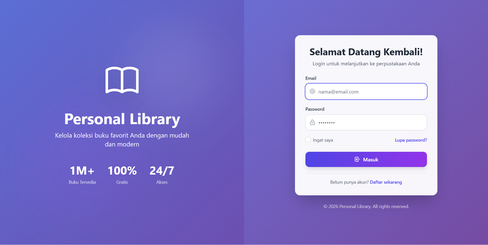
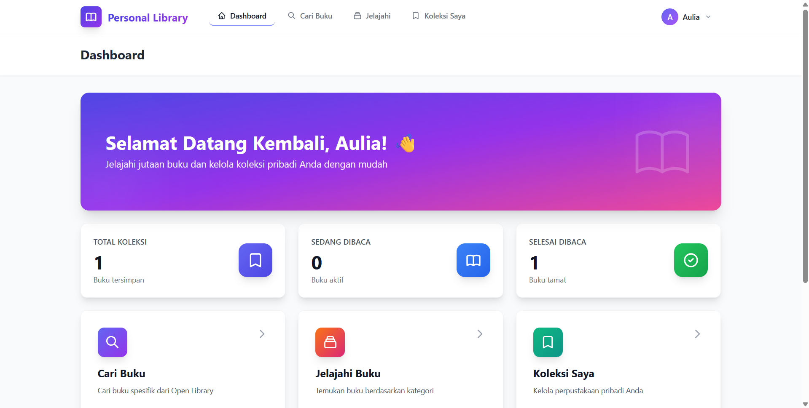
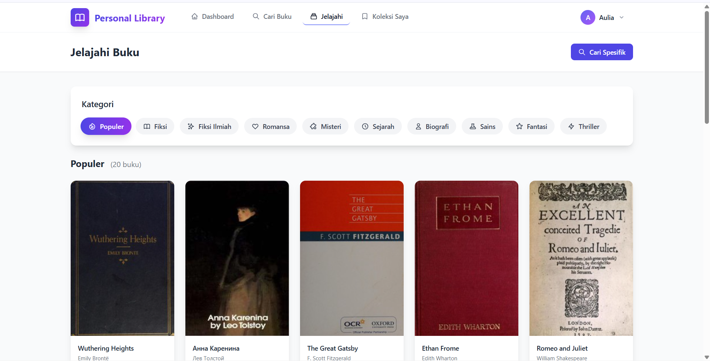
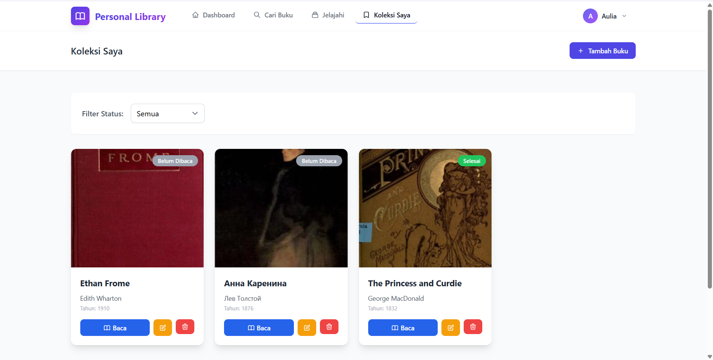
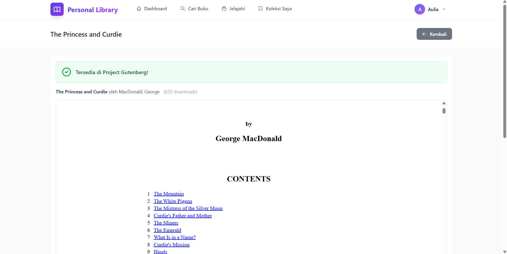

# Personal Library - Aplikasi Manajemen Buku

---

## Informasi Mahasiswa

| Keterangan         | Detail                         |
| ------------------ | ------------------------------ |
| **Nama**           | [Dinda Aulia Putri]            |
| **NIM**            | [2307009]                      |
| **Mata Kuliah**    | [Pemrograman Berbasis Web]     |
| **Dosen Pengampu** | [Sigit Hudawiguna S.Kom M.Kom] |

---

## Deskripsi Aplikasi

**Personal Library** adalah aplikasi web manajemen buku digital yang memungkinkan pengguna untuk:

- **Mencari buku** dari database Open Library dengan jutaan koleksi buku
- **Menjelajahi buku** berdasarkan kategori (Fiksi, Romansa, Sejarah, dll)
- **Menyimpan buku** ke koleksi pribadi
- **Mengelola koleksi** dengan catatan dan status membaca
- **Membaca buku** langsung melalui integrasi Project Gutenberg

---

## Teknologi yang Digunakan

### Backend

| Teknologi          | Versi | Deskripsi                            |
| ------------------ | ----- | ------------------------------------ |
| **PHP**            | ^8.2  | Bahasa pemrograman utama             |
| **Laravel**        | ^12.0 | Framework PHP untuk pengembangan web |
| **Laravel Breeze** | ^2.3  | Starter kit autentikasi              |
| **MySQL**          | -     | Database ringan untuk development    |

### Frontend

| Teknologi        | Versi   | Deskripsi                   |
| ---------------- | ------- | --------------------------- |
| **Tailwind CSS** | ^3.1.0  | Framework CSS utility-first |
| **Alpine.js**    | ^3.4.2  | Framework JavaScript ringan |
| **Vite**         | ^7.0.7  | Build tool dan dev server   |
| **Axios**        | ^1.11.0 | HTTP client untuk API calls |

### API Eksternal

| API                     | Deskripsi                   |
| ----------------------- | --------------------------- |
| **Open Library API**    | Pencarian dan metadata buku |
| **Open Library Covers** | Gambar cover buku           |
| **Project Gutenberg**   | Akses buku domain publik    |

### Development Tools

| Tool             | Deskripsi                     |
| ---------------- | ----------------------------- |
| **XAMPP**        | Local development environment |
| **Composer**     | PHP dependency manager        |
| **NPM**          | Node.js package manager       |
| **Laravel Pint** | PHP code style fixer          |

---

##  Cara Instalasi (Installation Guide)

### Prasyarat (Prerequisites)

Pastikan sistem Anda sudah terinstall:

- ✅ PHP >= 8.2
- ✅ Composer
- ✅ Node.js & NPM
- ✅ XAMPP (atau web server lainnya)

### Langkah Instalasi

#### 1. Clone Repository

```bash
git clone [URL_REPOSITORY]
cd manajemen_buku
```

#### 2. Install Dependencies PHP

```bash
composer install
```

#### 3. Install Dependencies Node.js

```bash
npm install
```

#### 4. Konfigurasi Environment

```bash
# Copy file environment
copy .env.example .env

# Generate application key
php artisan key:generate
```

#### 5. Setup Database

```bash
# Buat file database MySQL
type nul > database/database.msqyl

# Jalankan migrasi database
php artisan migrate
```

#### 6. Build Assets

```bash
# Untuk development
npm run dev

# Untuk production
npm run build
```

---

## Cara Menjalankan Aplikasi

### Metode 1: Menjalankan Terpisah (Recommended untuk Development)

**Terminal 1 - Laravel Server:**

```bash
php artisan serve
```

**Terminal 2 - Vite Dev Server:**

```bash
npm run dev
```

Buka browser dan akses: **http://localhost:8000**

### Metode 2: Menjalankan Bersamaan

```bash
composer dev
```

---

## Fitur Aplikasi

### 1. Autentikasi

- Registrasi pengguna baru
- Login/Logout
- Manajemen profil

### 2. Cari Buku

- Pencarian berdasarkan judul, penulis, atau ISBN
- Hasil pencarian dengan cover dan detail buku

### 3. Jelajahi Buku

- Grid view buku berdasarkan kategori
- 10 kategori tersedia: Populer, Fiksi, Fiksi Ilmiah, Romansa, Misteri, Sejarah, Biografi, Sains, Fantasi, Thriller

### 4. Koleksi Pribadi

- Simpan buku ke koleksi
- Tambah catatan pribadi
- Update status membaca (Belum Dibaca, Sedang Dibaca, Selesai)
- Hapus buku dari koleksi

### 5. Baca Buku Online

- Integrasi dengan Project Gutenberg
- Baca buku langsung di browser
- Download format EPUB

---

## Tangkapan Layar (Screenshots)

### Halaman Login



### Dashboard



### Jelajahi Buku



### Koleksi Saya



### Baca Buku



## Struktur Folder Utama

```
manajemen_buku/
├── app/
│   ├── Http/Controllers/        # Controller aplikasi
│   │   ├── BookBrowseController.php
│   │   ├── BookCollectionController.php
│   │   ├── BookReadController.php
│   │   └── BookSearchController.php
│   └── Models/                  # Model Eloquent
│       └── Book.php
├── resources/
│   ├── views/                   # Blade templates
│   │   ├── auth/               # Halaman autentikasi
│   │   ├── browse/             # Halaman jelajahi buku
│   │   ├── collection/         # Halaman koleksi
│   │   ├── components/         # Blade components
│   │   ├── layouts/            # Layout utama
│   │   ├── read/               # Halaman baca buku
│   │   └── search/             # Halaman pencarian
│   └── css/                    # Stylesheet
├── routes/
│   └── web.php                 # Definisi routes
├── database/
│   ├── migrations/             # Database migrations
│   └── database.mysql          # Database MySQL
└── public/                     # Public assets
```

---

## Routes Utama

| Method | URI           | Deskripsi                          |
| ------ | ------------- | ---------------------------------- |
| GET    | `/`           | Halaman landing/welcome            |
| GET    | `/dashboard`  | Dashboard pengguna                 |
| GET    | `/search`     | Cari buku                          |
| GET    | `/browse`     | Jelajahi buku berdasarkan kategori |
| GET    | `/collection` | Koleksi buku pribadi               |
| GET    | `/read/{id}`  | Baca buku                          |

---

## Lisensi

Aplikasi ini menggunakan framework [Laravel](https://laravel.com) yang berlisensi [MIT license](https://opensource.org/licenses/MIT).

---
